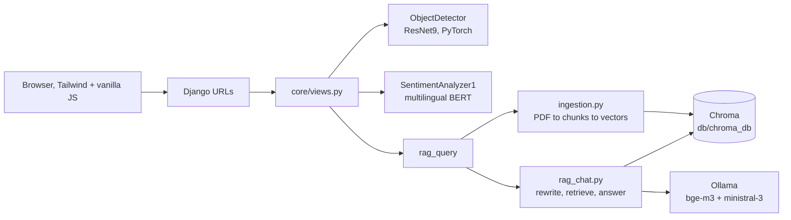

# E-VIE: an environmental AI platform built with Django

E-VIE (the repository folder is called `Made-AI-Django`) is a small web platform that puts three different AI tools behind one Django site. The idea is simple: give communities and field workers something they can open in a browser to look at a sick plant leaf, check the tone of a piece of text, or ask questions about environmental protection and get answers grounded in real documents.

The interface is in French, the code and this file are in English.

## What it does

| Page | URL | What happens |
|------|-----|--------------|
| Home | `/` | Landing page with the three tools |
| Plant disease detection | `/detect/` | Upload a leaf photo, get the three most likely diagnoses with confidence scores |
| Sentiment analysis | `/sentiment/` | Type some text, get a positive or negative label |
| Chat assistant | `/chat/` | Ask a question, get an answer built from a set of environmental PDFs (RAG) |

Each page also has a JSON endpoint under `/api/`, so the same models can be called from another app or from `curl`.

## How it fits together



Everything runs locally. No call leaves the machine once the models are downloaded, which matters when the people using it have patchy internet.

## The three AI pieces

### 1. Plant disease detection

The model is a ResNet9 trained on the 38-class leaf disease setup (apple, corn, grape, potato, tomato and others, plus a "background without leaves" class). The weights live in `core/services/models/plant-disease-model.pth`. At request time the image is resized to 224 by 224, passed through the network, and a softmax gives probabilities. The API returns the top three classes with their confidence as a percentage.

Code: `core/services/ai_services.py`, class `ObjectDetector`.

### 2. Sentiment analysis

This uses `nlptown/bert-base-multilingual-uncased-sentiment` from Hugging Face. That model predicts a 1 to 5 star rating. I take the argmax and collapse it: the three lowest ratings count as negative, the other two as positive. It works on French and English, which suits the site. There is no neutral class at the moment, and I would like to change that.

Code: `core/services/sentiment_service.py`, class `SentimentAnalyzer1`.

### 3. Chat assistant (RAG)

This is the part I spent most time on. The assistant does not answer from the language model's memory. It looks things up first.

1. **Ingestion** (`core/services/rag/ingestion.py`). PDFs in `docs/` are read with PyMuPDF and cut into chunks of 1000 characters with an overlap of 100. Each chunk is embedded with `bge-m3` through Ollama and stored in a persistent Chroma database at `db/chroma_db`. If that folder already exists, ingestion is skipped.
2. **Question rewriting** (`rag_chat.py`). If there is earlier conversation, the model first rewrites the new question so it stands on its own ("and what about the law?" becomes a full question).
3. **Retrieval** (`retrieval.py`). The five closest chunks by cosine similarity are fetched.
4. **Answer**. `ministral-3` gets those chunks and is told to answer using only that context.

The knowledge base is five PDFs on environmental protection, environmental requirements, human well-being and the right to a clean environment (about 300 pages in total).

## Project layout

```text
Made-AI-Django/
  manage.py
  requirements.txt
  setup.sh                    quick setup script
  .env.example                copy to .env
  aura_project/               Django settings, root urls, wsgi
  core/
    models.py                 ChatMessage, DetectionResult, SentimentAnalysis
    views.py                  page views and API views
    urls.py                   page routes
    api_urls.py               /api/ routes
    services/
      ai_services.py          ResNet9 detector and rag_query entry point
      sentiment_service.py    BERT sentiment wrapper
      models/                 plant disease weights (.pth)
      rag/
        ingestion.py          build the vector store
        retrieval.py          retriever (k = 5, cosine)
        rag_chat.py           history-aware question answering
  templates/                  base, home, detection, sentiment, chatbot
  static/                     css and images
  docs/                       PDFs used as the knowledge base
  db/chroma_db/               persisted vector store
  media/                      uploaded images
```

A few files are older experiments and are not part of the running path: `core/services.py` (an earlier Gemini and YOLO version), `core/services/ai_service.py` and `core/services/rag/rag_chat1.py`. I kept them for reference.

## Running it

You need Python 3.11 or 3.12, and [Ollama](https://ollama.com) installed.

```bash
# 1. environment
python -m venv venv
source venv/bin/activate          # Windows: venv\Scripts\activate
pip install -r requirements.txt

# 2. settings
cp .env.example .env              # then edit SECRET_KEY

# 3. local models for the chat assistant
ollama pull bge-m3
ollama pull ministral-3

# 4. database and server
python manage.py migrate
python manage.py runserver
```

Open `http://localhost:8000`. Run commands from the project root, because the retriever looks for `db/chroma_db` relative to it.

The first start is slow. The sentiment model is downloaded from Hugging Face, and the first chat question builds the vector store from the PDFs. After that it is quick.

## API

| Endpoint | Method | Body | Returns |
|----------|--------|------|---------|
| `/api/detect/` | POST | form-data with `image` | `top_predictions`: list of label and confidence |
| `/api/sentiment/` | POST | `{"text": "..."}` | `sentiment`, `score`, `explanation` |
| `/api/chat/` | POST | `{"message": "..."}` | `response` |
| `/api/chat/history/` | GET | none | last 50 saved messages |

```bash
curl -X POST -F "image=@leaf.jpg" http://localhost:8000/api/detect/
curl -X POST -H "Content-Type: application/json" -d '{"text":"I love this!"}' http://localhost:8000/api/sentiment/
curl -X POST -H "Content-Type: application/json" -d '{"message":"What is the right to a clean environment?"}' http://localhost:8000/api/chat/
```

## Settings

| Variable | Purpose |
|----------|---------|
| `DEBUG` | `True` for development, `False` in production |
| `SECRET_KEY` | Django secret, set your own |
| `ALLOWED_HOSTS` | comma separated hosts |
| `GOOGLE_API_KEY` | only needed by the old Gemini code, not by the current pipeline |

The `.env` file is ignored by git. Do not commit real keys.

## Things I know are not finished

I would rather list these than have someone find them later.

- **Chat history is global.** `rag_chat.py` keeps one conversation in memory, so all visitors share it. It should be tied to a session.
- **Persistence is partial.** The database models exist and the admin is set up, but the current chat, detection and sentiment endpoints do not write to them, so `/api/chat/history/` stays empty.
- **No evaluation yet.** I have not measured retrieval quality (recall at k, answer faithfulness) or how well the confidence scores are calibrated. Softmax confidence from the leaf model is not a probability you should fully trust, especially on field photos that look different from the training images.
- **Sentiment is binary.** A neutral class would be more honest.
- **Chunking is basic.** A fixed 1000 character split can cut a paragraph in the middle. Splitting on structure or testing other sizes is on the list.
- **The chat endpoint skips CSRF checks**, which is fine locally and not fine in production.

## Stack

Django 5, Django REST Framework, django-cors-headers, SQLite, PyTorch and torchvision, Hugging Face Transformers, LangChain, Chroma, PyMuPDF, Ollama, Tailwind CSS (CDN).

## Author

Joel Rostand Nteupe, data scientist and AI/ML engineer based in Dakar, Senegal.
