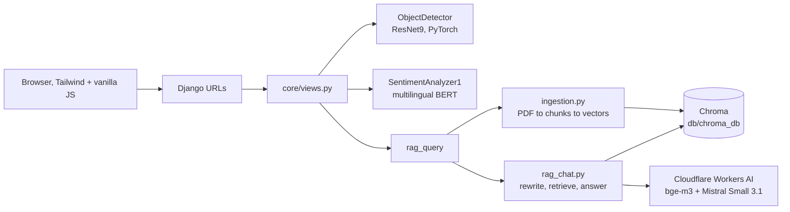

# E-VIE: an environmental AI platform built with Django

E-VIE (the repository folder is called `Made-AI-Django`) is a small web platform that puts three different AI tools behind one Django site. The idea is simple: give communities and field workers something they can open in a browser to look at a sick plant leaf, check the tone of a piece of text, or ask questions about environmental protection and get answers grounded in real documents.

The interface is in French, the code and this file are in English.

## What it does

| Page | URL | What happens |
|------|-----|--------------|
| Home | `/` | Landing page with the three tools |
| Plant disease detection | `/detect/` | Upload a leaf photo, get the three most likely diagnoses with confidence scores |
| Sentiment analysis | `/sentiment/` | Type some text, get a positive or negative label |
| Chat assistant | `/chat/` | Ask a question, get an answer built from a set of environmental PDFs (RAG), with the pages it cites; the documents are listed next to the chat |

Each page also has a JSON endpoint under `/api/`, so the same models can be called from another app or from `curl`.

## How it fits together



The leaf and sentiment models run inside the app (CPU). The chat assistant calls Cloudflare Workers AI through its OpenAI-compatible API for embeddings and generation, so the server does not need a GPU.

## The three AI pieces

### 1. Plant disease detection

The model is a ResNet9 trained on the 38-class leaf disease setup (apple, corn, grape, potato, tomato and others, plus a "background without leaves" class). The weights live in `core/services/models/plant-disease-model.pth`. At request time the image is resized to 224 by 224, passed through the network, and a softmax gives probabilities. The API returns the top three classes with their confidence as a percentage.

Code: `core/services/ai_services.py`, class `ObjectDetector`.

### 2. Sentiment analysis

This uses `nlptown/bert-base-multilingual-uncased-sentiment` from Hugging Face. That model predicts a 1 to 5 star rating. I take the argmax and collapse it: the three lowest ratings count as negative, the other two as positive. It works on French and English, which suits the site. There is no neutral class at the moment, and I would like to change that.

Code: `core/services/sentiment_service.py`, class `SentimentAnalyzer1`.

### 3. Chat assistant (RAG)

This is the part I spent most time on. The assistant does not answer from the language model's memory. It looks things up first.

1. **Ingestion** (`core/services/rag/ingestion.py`). PDFs in `docs/` are read with PyMuPDF and cut into chunks of 1000 characters with an overlap of 100. When a PDF has a `<name>.ocr.txt` next to it, that text is used instead: `Environment_and_human_complete.pdf` embeds fonts without a Unicode map, so its text layer extracts as gibberish, and its text comes from `ocrmypdf --force-ocr -l eng --sidecar`. Pages of credits, contents, acknowledgements, author lists and references are skipped (headings in English or French; a reference list also takes the reference-heavy pages next to it), and chunks that are mostly noise (page numbers, figure tables, unreadable text) are dropped. Each chunk is embedded with `@cf/baai/bge-m3` on Workers AI and stored in Chroma under `$DATA_DIR/chroma_<fingerprint>`, where the fingerprint covers the documents, the embedding model and the ingestion version. Changing any of them builds a new index on the next start, with four embedding requests in flight (about 35 s for 2,300 chunks); `python manage.py ingest_docs --force` rebuilds the current one.
2. **Routing** (`rag_chat.py`). Greetings, thanks and acknowledgements ("oh i see", "c'est noté") get a short reply without any search: a message is an acknowledgement when it has no question mark and only interjections and politeness words. Messages with no real word ("ko", "?") get a fixed request for clarification. A "yes" to an offer the assistant just made ("Voulez-vous des exemples ?") searches for what was offered. Replies follow the language of the conversation (French or English).
3. **Search query**. A small model (`CF_AI_REWRITE_MODEL`) turns the message into a standalone question in English, resolving follow-ups such as "and in Africa?", or answers NONE when the message asks for nothing, which leads to a short reply instead of a search. The documents are in English and the reranker below only judges English queries reliably.
4. **Retrieval** (`retrieval.py`). The 20 closest chunks by cosine similarity are scored by a cross-encoder (`@cf/baai/bge-reranker-base`). If even the best one is below the relevance gate, the assistant says the documents do not cover the topic instead of answering from unrelated text; otherwise the five best are kept.
5. **Answer**. The chat model (`CF_AI_CHAT_MODEL`, default `@cf/mistralai/mistral-small-3.1-24b-instruct`) gets those chunks and is told to answer using only them, in the language of the conversation.

The knowledge base is 13 PDFs listed in `docs/catalog.json` (title, publisher, year, language and a short description, shown in the documents panel of the chat page): Senegal's environment code (2023) and nationally determined contribution (2020), the Great Green Wall status report (UNCCD, 2020), a guide to municipal solid waste in Africa, the IPCC AR6 WGI Summary for Policymakers, the Kunming-Montreal biodiversity framework, FAO's State of the World's Forests 2024 and a UN report on education for sustainable development, all in French; plus five English documents on environmental protection, human well-being, humanitarian requirements and the right to a clean environment. About 650 pages are indexed. Each answer lists up to three pages it was written from, linking to `/documents/<file>#page=<n>`, which opens the PDF at that page.

Three PDFs had their images downsampled for the browser; the Great Green Wall report could not be downsampled without breaking its text, so its compressed copy is served and the exact text of the original sits next to it as a sidecar.

## Project layout

```text
Made-AI-Django/
  manage.py
  requirements.txt
  setup.sh                    quick setup script
  .env.example                copy to .env
  aura_project/               Django settings, root urls, wsgi
  core/
    models.py                 ChatMessage, DetectionResult, SentimentAnalysis
    views.py                  page views and API views
    urls.py                   page routes
    api_urls.py               /api/ routes
    services/
      ai_services.py          ResNet9 detector and rag_query entry point
      sentiment_service.py    BERT sentiment wrapper
      models/                 plant disease weights (.pth)
      rag/
        ingestion.py          build the vector store
        retrieval.py          retriever (k = 5, cosine)
        rag_chat.py           history-aware question answering
  templates/                  base, home, detection, sentiment, chatbot
  static/                     css and images
  docs/                       PDFs used as the knowledge base
  db/chroma_db/               persisted vector store
  media/                      uploaded images
```

A few files are older experiments and are not part of the running path: `core/services.py` (an earlier Gemini and YOLO version), and `core/services/ai_service.py`. I kept them for reference.

## Running it

You need Python 3.12 and a Cloudflare account with Workers AI enabled (an API token with the *Workers AI: Read* permission and your account id).

```bash
# 1. environment
python -m venv venv
source venv/bin/activate          # Windows: venv\Scripts\activate
pip install --extra-index-url https://download.pytorch.org/whl/cpu -r requirements.txt

# 2. settings
cp .env.example .env              # set SECRET_KEY, CF_ACCOUNT_ID, CF_API_TOKEN, DATA_DIR=.

# 3. database, vector index, server
python manage.py migrate
python manage.py ingest_docs
python manage.py runserver
```

Open `http://localhost:8000`. The first start downloads the sentiment model from Hugging Face.

### Docker / Coolify

The `Dockerfile` builds a CPU-only image with the sentiment model baked in. On start the entrypoint runs migrations, ingests the PDFs if the index is empty, then serves with gunicorn on port 8000.

```bash
docker compose up --build          # local test, reads .env
```

Deployment on Coolify: application from this Git repository, build pack **Dockerfile**, port `8000`, a persistent volume mounted on `/data`, and the variables from `.env.example` as environment variables (production: `DEBUG=False`, `ALLOWED_HOSTS` and `CSRF_TRUSTED_ORIGINS` set to the public domain).

## API

| Endpoint | Method | Body | Returns |
|----------|--------|------|---------|
| `/api/detect/` | POST | form-data with `image` | `top_predictions`: list of label and confidence |
| `/api/sentiment/` | POST | `{"text": "..."}` | `sentiment`, `score`, `explanation` |
| `/api/chat/` | POST | `{"message": "..."}` | `response`, and `sources`: up to three `{title, page, url}` the answer was written from |
| `/api/chat/history/` | GET | none | last 50 saved messages |

```bash
curl -X POST -F "image=@leaf.jpg" http://localhost:8000/api/detect/
curl -X POST -H "Content-Type: application/json" -d '{"text":"I love this!"}' http://localhost:8000/api/sentiment/
curl -X POST -H "Content-Type: application/json" -d '{"message":"What is the right to a clean environment?"}' http://localhost:8000/api/chat/
```

## Settings

| Variable | Purpose |
|----------|---------|
| `DEBUG` | `True` for development, `False` (default) in production |
| `SECRET_KEY` | Django secret, set your own |
| `ALLOWED_HOSTS` | comma separated hosts |
| `CSRF_TRUSTED_ORIGINS` | comma separated origins, e.g. `https://evie.example.org` |
| `DATA_DIR` | where SQLite, uploads and the Chroma index live (`/data` in Docker) |
| `CF_ACCOUNT_ID`, `CF_API_TOKEN` | Cloudflare account id and Workers AI token |
| `CF_AI_CHAT_MODEL` | answer model, default `@cf/mistralai/mistral-small-3.1-24b-instruct` (GLM models work too, their reasoning is turned down automatically) |
| `CF_AI_REWRITE_MODEL` | fast model that writes the English search query, default `@cf/zai-org/glm-4.7-flash` |
| `CF_AI_RERANK_MODEL` | cross-encoder that scores passages, default `@cf/baai/bge-reranker-base` |
| `CF_AI_EMBED_MODEL` | embedding model, default `@cf/baai/bge-m3` (changing it requires `ingest_docs --force`) |
| `RAG_CANDIDATES`, `RAG_TOP_K` | chunks proposed by the vector search (20) and kept after reranking (5) |
| `RAG_MIN_RELEVANCE`, `RAG_MIN_PASSAGE_RELEVANCE` | reranker score the best passage must reach (0.05), and the floor for the others (0.01) |
| `RAG_HISTORY_TURNS` | conversation turns kept per session |
| `WEB_CONCURRENCY` | gunicorn workers in Docker, default 2 |

The `.env` file is ignored by git. Do not commit real keys.

## Things I know are not finished

I would rather list these than have someone find them later.

- **Persistence is partial.** The database models exist and the admin is set up, but only the chat endpoint writes to them; detection and sentiment results are not stored.
- **Evaluation is small.** `python manage.py eval_rag` runs `evaluation/questions.json`: 50 questions written from random passages (16 on the French documents), plus 12 off-topic messages, 20 acknowledgements and 8 short questions. The source page is found for 39 of 50 questions and the source PDF for 46; no off-topic message gets documents, all acknowledgements are answered without a search, and the short questions are still searched. Answer faithfulness is not measured, and neither is the calibration of the leaf model's softmax confidence, which you should not fully trust on field photos that look different from the training images.
- **Sentiment is binary.** A neutral class would be more honest.
- **Chunking is basic.** A fixed 1000 character split can cut a paragraph in the middle. Splitting on structure or testing other sizes is on the list.
- **The chat endpoint skips CSRF checks**, which is fine locally and not fine in production.

## Stack

Django 5, Django REST Framework, django-cors-headers, SQLite, PyTorch and torchvision, Hugging Face Transformers, LangChain, Chroma, PyMuPDF, Cloudflare Workers AI, gunicorn, whitenoise, Tailwind CSS (CDN).

## Author

Joel Rostand Nteupe, data scientist and AI/ML engineer based in Dakar, Senegal.
